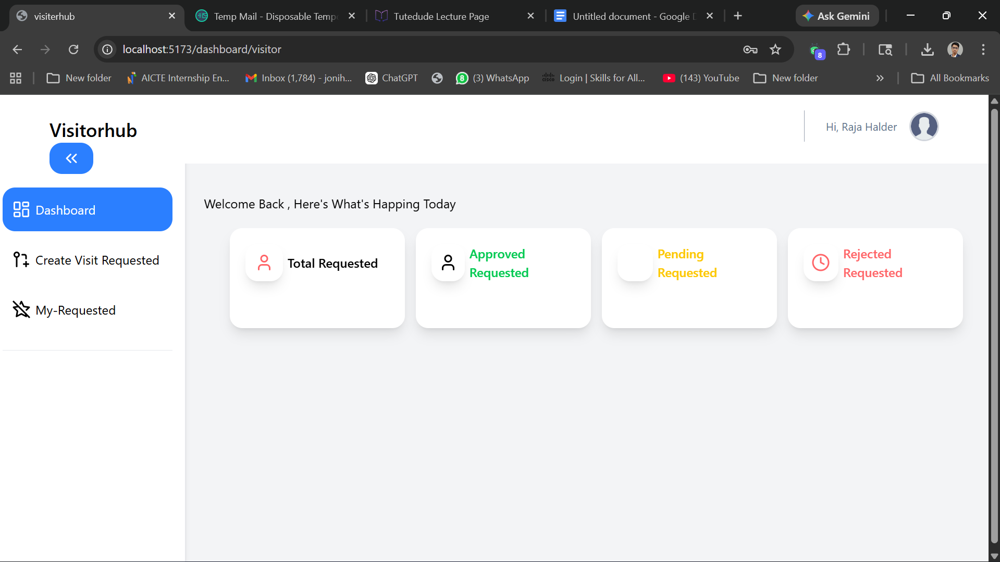
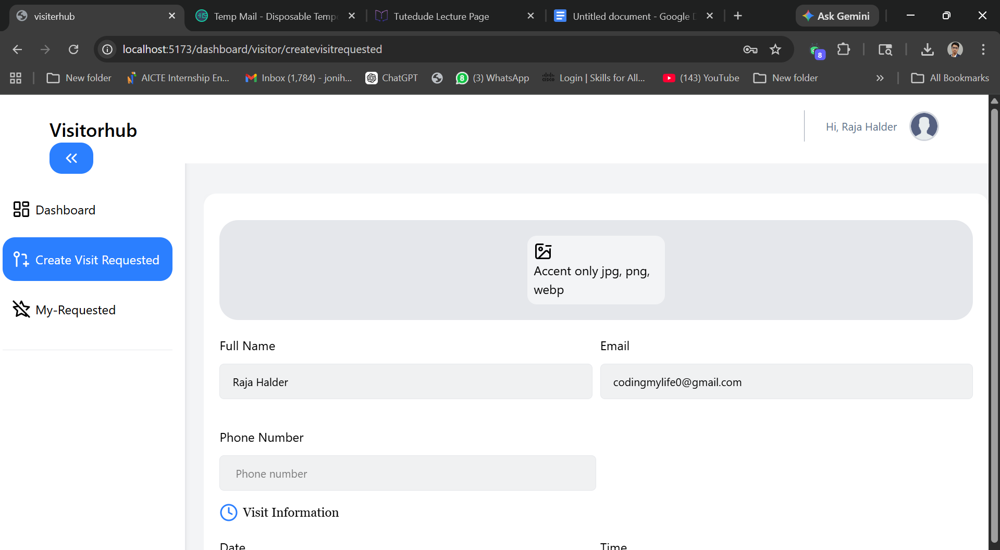
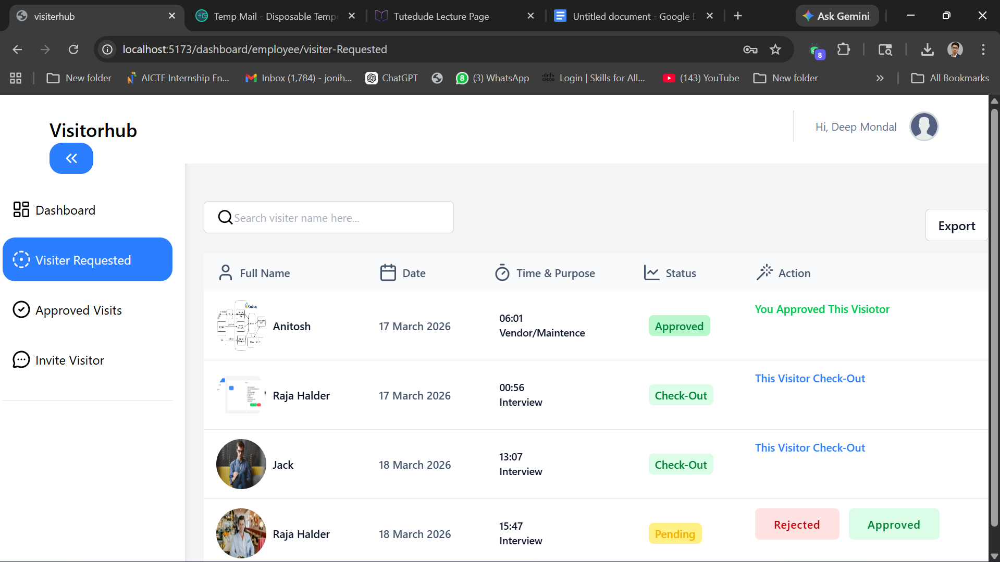
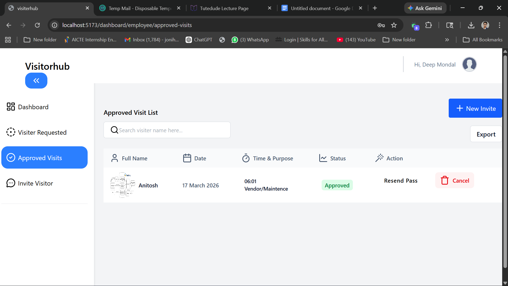
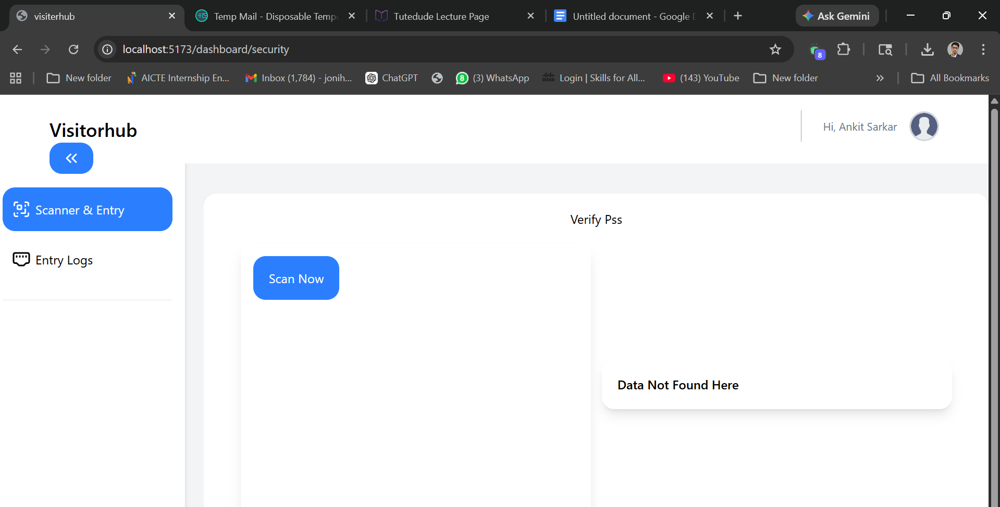
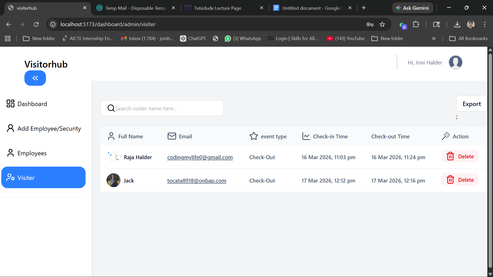
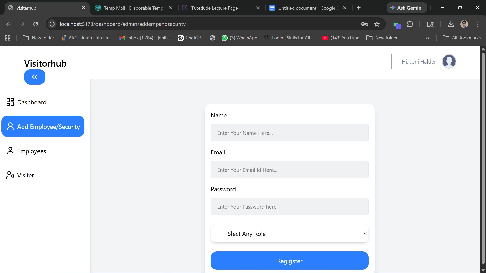
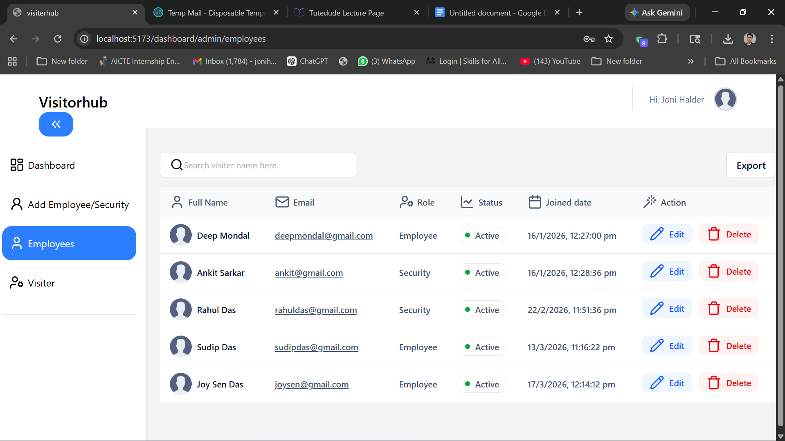

# visitorpassmanagementsystem

A fully role-base secure Visitor Mangement System With Qr code validation, email notifications, and real-time check-in/check-out tracking...

## Project OverView
The Visitor pass management system helps organizRUIBA NbFW bs moburie visior entry in a secure and setuecured way.
---
The Stystem Includes four roles:
- Visitor
- Employee
- Security
- Admin

** Each role has different permissions and responsibilities in the system.
---
## project Explantoin 
-[Watch The demo video](https://share.vidyard.com/watch/ukY5erFV76qckYfyV9qo6B)

---
## Project demonstarates:
- Authentication and authorzation.
- Visitor Request workflow.
- Qr code generation and validation.
- Email nofificatin system.
- Visitor check-in and check-our tracking.

## stystem workflow
Visitor :
-> create visit request.
- visitor dashboard home page

- visitor dashboard create visitor requested page

- visitor dashboard visitor status page

...
Employee reviews request
-> Employee approves or rejects request .
-> Qr code generated for approved visitor.
- Employee dashboard All visitor request page
 
- Employee dashboard approved visitor  page
 
...
security scan Qr code at entry gate
-> Visitor check-in and check-out recorded.
- security dashboard scan qr code page
 
- security dashboard visitor check-in and check-out page
 
...
Admin monitors system activity.
- Admin dashboard create Employee/security page
 
- Admin dashboard all Employee/security page
 
- Admin dashboard visitor checkin and checkout time data table
 
## user Roles & Featues 

## Visitor Features

- Regisiter & Login
- Create Visit Request
- Recevie Approval / Rejection Email
- Download Qr Code visitor pass
---
## Employee Features

- View All Visitor requests
- Approve or  Reject requests
- Triggger Email Nofifications
- Generate Qr Code Passes

---
## security Features

- Scan visitor Qr code
- Check-In and Check-out visitor
- Invalid Pass Detection (3rd Scan Block)
- View Entry Logs

---

## Admin Features

- Crate Employee & Secuiry Accouts
- Mange Users
- Invalid Pass Detection (3rd Scan Block)
- Export System Data
- Monitor visitor activity
- Access Full Dashboard Control
---

## Security Implementation
** The system includes multiple security layers:

- Jwt Authentioncation
- Role-Base Authorzation
- Protected Route Middlware
- Api request validation
- Rate Limiting 
- Secure Api Validation
- Qr Code Validation Login
- Email Notification Integration

---
## Tech Stack

*** Frontend
- React.js
- Axios
- React Router
---
*** Backend 
- Node.js
- Express.js
- MongoDb

--- Other services
- Cloudinary
- Brevo Smtp (email nofifications)
- Qr Code Generator
- pdf visitor pass generation
---
Environment Variables Setup

- create a .env file inside thel backend folder.
example :
```bash
MONGO_URL=your_mongodb_url
JWT_SECRET_KEY=your_secret_key
CLIENT_URL=http://localhost:5173
EMAIL_USER=your_email_id
EMAIL_PASS=your_email_pass
PORT=3000
NODE_ENV=
BREVO_FROM_EMAIL=your_brevo_email
BREVO_SMTP_USER=your_smtp
BREVO_SMTP_PASS=your_smtp_pass_here
BREVO_API_KEY=your_brevo_api_key
CLOUDINARY_CLOUD_NAME=your_cloudinary_name
CLOUDINARY_API_KEY=your_cloundiary_api_key
CLOUDINARY_API_SECRET=your_cloudinary_api_secret
```
----
## 1 ) How to run the Project
 
 ``` bash
 git clone git@github.com:joni7679/library-management-system.git

 ```
 2) install Backend  Dependencies
 ``` bash
 cd backend
 ```
```bash 
npm i
``` 
3.  start backend server 
``` bash
npm run dev
```
the backend server will start on
 http://localhost:3000

 # Api Explantion:
- Method:-  Post 
- apiendpoint:- api/auth/register 
- Description:-  create new account
---
- Method:-  Post 
- apiendpoint:- api/auth/login 
- Description:-  login user
---
- Method:-  Post 
- apiendpoint:- api/auth/logout 
- Description:-  logout  the user
---
- Method:-  Get 
- apiendpoint:- api/auth/profile
- Description:-  get user profile
---


 4. install frontend depdencies
 ``` bash
 cd frontend
 ```
 ``` bash
 npm i
 ```

 Environment Variables Setup

- create a .env file inside thel frontend folder.
example :
```bash
VITE_BACKEND_URL=http://localhost:3000
```
----
 5. start frontend
  ``` bash
  npm run dev
  ```
  frontend will run on
  
  http://localhost:5173
---
